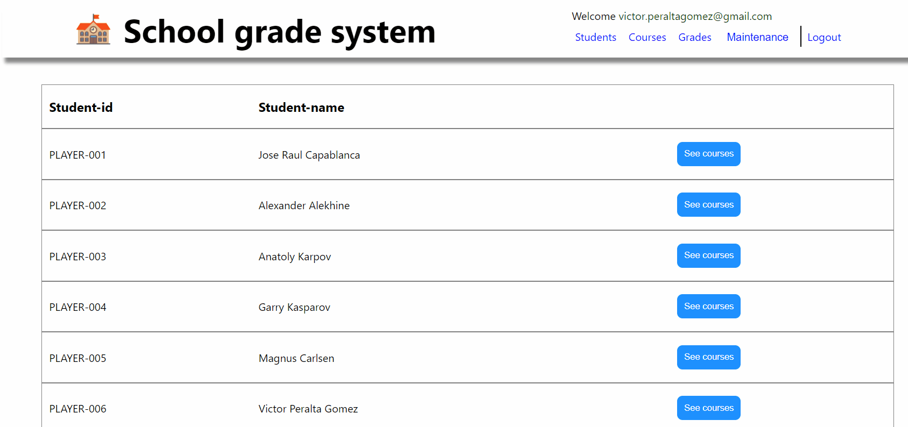

# School-Grade System
> An App that lets you manage catalogs of students, courses, and grades

## Built With   
- React / Redux
- Ruby / Rails
- HTML/CSS/JS

## Prerequisites  
- Node (14 or newer)
- React (18 or newer)
- Redux/toolkit (1.8.5 or newer)
- React-router (6.3 or newer)
- Reactjs-popup (2.0 or newer)
- PostgreSql   
- Ruby (2.7 or newer)
- Bundle (2.1.4 or newer)

## Getting Started

To get a local copy follow these simple steps.  

1.- Open the terminal window and clone the repository using this command:  
`git clone git@github.com:VicPeralta/dl-react.git` 

2.- Change the directory to the blogapp directory  
`cd dl-react`  
3.- Install the project's dependencies by running this command:   
`npm install`  
4.- Start the server using this command:  
`npm start`   

## Server repo

https://github.com/VicPeralta/dl-rails

## Authors

👤 **Victor Peralta**
- GitHub: [@VicPeralta](https://github.com/VicPeralta)
- Twitter: [@VicPeralta](https://twitter.com/VicPeralta)
- Linkedin: [@VicPeralta](https://www.linkedin.com/in/vicperalta/)

## 🤝 Contributing

Contributions, issues, and feature requests are welcome!

Feel free to check the [issues page](../../issues/).

## Show your support

Give a ⭐️ if you like this project!
The gem is available as open source under the terms of the [MIT License](https://opensource.org/licenses/MIT).
